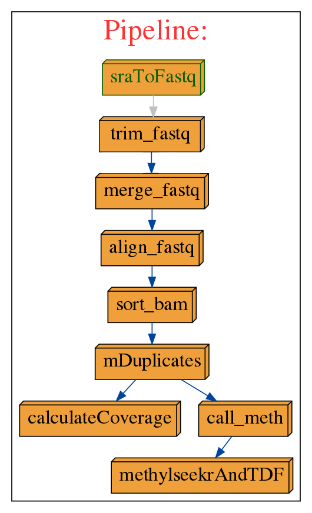

# Majel Whole Genome Bisulfite Sequencing (WGBS) processing pipeline

This data processing pipeline (nicknamed Majel) will process both paired- and single-end SRA files (from NCBI SRA database)\
or paired-end FASTQ files. Fastq files can be obtained from some public data repositories, directly from your sequencing \
provider or using bcl2fastq (on illumina output). SRA files can be obtained from [NCBI SRA database](https://www.ncbi.nlm.nih.gov/) using your prefered \
method (e.g. wget).\
\
Majel will automate all subsequent standard processing steps, including conversion from sra to fastq (fastq-dump), read \
trmming & FASTQC (trim-galore), mapping (bismark), duplicate marking (picard), methylation bias assesment & CpG methylation \
calling (methyldackel), borwser tracks, UMR/LMR/PMD calls, as well as produce some summary statistics.



## Output 
The pipeline will output the following.

* Processed bam file & index (aligned, sorted and duplicate marked)
* Some summary statistics (average genomic coverage, read counts, duplication rate)
* CpG methylation calls in bedGraph format (with --merge-context)
* QC files
   * Methylation bias plots
   * FASTQC reports
* MethylSeekR UMR, LMR and PMD calls plus QC plots
* TDF file for viewing in IGV

\
A large number of intermediate files are also produced, these can be removed (and the final directory structure formed) using the \
included cleanup script\
```> cleanup.sh sampleID```

These intermediate files can be very large when working with high-coverage datasets. This can be especially true during the \
bismark mapping steps or when running from SRA files. When running from SRA, cleanup.sh will not remove fastq files produced\
by fastq-dump. The user must remove these manually. This is to prevent the accidental deletion of raw fastq files when running on\
user generated data. This can also be prevented by good data practices (e.g. soft linking raw data).

## Using Majel
Majel makes use of the Python pipelining module ruffus (see [ruffus docs](http://www.ruffus.org.uk/)). Expect a long walltime on\
high coverage datasets (>5 days).\
\
Majel help is available using the '--help' flag.

Basic usage:\
cd to data folder\
python3 Path_to_majel_wgbspipline/Majey.py --data_dir Path_to_data/ --genome hg19/hg_38/mm10 --file_type sra/FASTQ --sampleID Name_of_tissue --genomePath Path_to_genome_folder/ -v 3 -L Path_to_data/Log_file \

```
usage: Majel.py [-h] [--verbose [VERBOSE]] [--version] [-L FILE] [-T JOBNAME]
                [-j N] [--use_threads] [-n] [--touch_files_only]
                [--recreate_database] [--checksum_file_name FILE]
                [--flowchart FILE] [--key_legend_in_graph]
                [--draw_graph_horizontally] [--flowchart_format FORMAT]
                [--forced_tasks JOBNAME] [--genome GENOME]
                [--data_dir DATA_DIR] [--sample_name SAMPLE_NAME]
                [--aligner_threads ALIGNER_THREADS] [--pbat]
                [--is_paired_end IS_PAIRED_END] [--genome_path GENOME_PATH]

Majel.py - Automated WGBS processing pipeline for sra and fastq file types

optional arguments:
  -h, --help            show this help message and exit
  --genome GENOME       Genome for alignment. Must be a directory in your
                        --genome_path. Defaults to hg38 (hg38)
  --data_dir DATA_DIR   Directory for input fastq/sra files
  --sample_name SAMPLE_NAME
                        Sample name. Used for output file names and should
                        match directory name. Will determine colouring of TDF
                        track file and must conform to following convention
                        "Tissue_SubTissue_HealthStatus_Identifier"
  --aligner_threads ALIGNER_THREADS
                        Speed up alignment by increasing number of threads.
                        Values depends on the aligner. Defaults to 5
  --pbat                Specify when aligning pbat library
  --is_paired_end IS_PAIRED_END
                        Is the libarary paired end (defaults to True)
  --genome_path GENOME_PATH
                        Path to genome folder, must contain a --genome
                        directory

Common options:
  --verbose [VERBOSE], -v [VERBOSE]
                        Print more verbose messages for each additional
                        verbose level.
  --version             show program's version number and exit
  -L FILE, --log_file FILE
                        Name and path of log file

pipeline arguments:
  -T JOBNAME, --target_tasks JOBNAME
                        Target task(s) of pipeline.
  -j N, --jobs N        Allow N jobs (commands) to run simultaneously.
  --use_threads         Use multiple threads rather than processes. Needs
                        --jobs N with N > 1
  -n, --just_print      Don't actually run any commands; just print the
                        pipeline.
  --touch_files_only    Don't actually run the pipeline; just 'touch' the
                        output for each task to make them appear up to date.
  --recreate_database   Don't actually run the pipeline; just recreate the
                        checksum database.
  --checksum_file_name FILE
                        Path of the checksum file.
  --flowchart FILE      Don't run any commands; just print pipeline as a
                        flowchart.
  --key_legend_in_graph
                        Print out legend and key for dependency graph.
  --draw_graph_horizontally
                        Draw horizontal dependency graph.
  --flowchart_format FORMAT
                        format of dependency graph file. Can be 'pdf', 'svg',
                        'svgz' (Structured Vector Graphics), 'pdf', 'png'
                        'jpg' (bitmap graphics) etc
  --forced_tasks JOBNAME
                        Task(s) which will be included even if they are up to
                        date.
```
 
## Required software
Majel was written using the following packages
* FastQC v0.11.5
* bismark-0.18.1 https://www.bioinformatics.babraham.ac.uk/projects/bismark/
* Methyldackel-0.3.0 (using HTSlib version 1.2.1) https://github.com/dpryan79/MethylDackel
* trim_galore-0.4.3 https://www.bioinformatics.babraham.ac.uk/projects/trim_galore/
* fastq-dump : 2.8.2 (from sra toolkit) https://www.ncbi.nlm.nih.gov/sra/docs/toolkitsoft/
* samtools-1.4.1 (using htslib 1.4.1) http://www.htslib.org/doc/samtools.html
* picard MarkDuplicates version 2.9.4-1-gcda9516-SNAPSHOT https://broadinstitute.github.io/picard/command-line-overview.html
* igvtools (from IGV Version 2.3.95)
* bedtools 2.26.0

\
Majel will call the following python modules
* ruffus
* os
* subprocess
* time
* shlex
* re
* pandas
* sys

\
Majel requires the following R packages
* littler
* optparse
* MethylSeekR
* data.table
* GenomicRanges
* rtracklayer
* BSgenome
* BSgenome.Hsapiens.UCSC.hg19
* BSgenome.Hsapiens.UCSC.hg38
* BSgenome.Mmusculus.UCSC.mm10
* parallel
